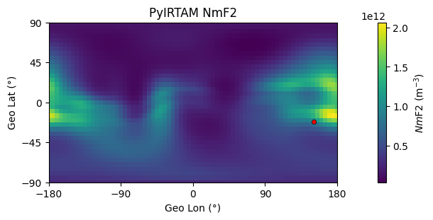
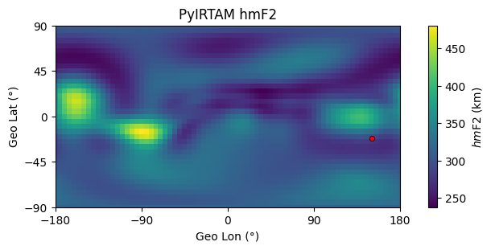

# PyIRTAM

[](https://pypi.org/project/PyIRTAM/)
[](https://github.com/victoriyaforsythe/PyIRTAM/actions/workflows/main.yml)
[](https://coveralls.io/github/victoriyaforsythe/PyIRTAM?branch=main)
[](https://pyirtam.readthedocs.io/en/latest/?badge=latest)
[](https://doi.org/10.5281/zenodo.10844521)

Python tool for processing IRTAM coefficients that evaluates ionospheric
parameters and electron density on the entire given global grid and for the
entire day simultaneously.


## Installation

Install from PyPI:

```bash
pip install PyIRTAM
```

Or clone and install from the GitHub repository:

```bash
git clone https://github.com/victoriyaforsythe/PyIRTAM.git
cd PyIRTAM
pip install .
```

For more details and usage examples, see the Jupyter [tutorials](https://github.com/victoriyaforsythe/PyIRTAM/tree/main/docs/tutorials).

---

## Example: Daily Ionospheric Parameters (I have IRTAM coefficients)

PyIRTAM computes daily ionospheric parameters with 15-min resolution IRTAM coefficietns.
The user provides the F10.7 index for the day of interest, the **alon** and **alat** grid,
the vertical grid **aalt**, and the time array of interest **ahr**.

Define the F10.7 index in solar flux units (sfu):

```python
F107 = 90.8
```

Define day of interest:

```python
year = 2022
month = 1
day = 1
```

Run PyIRTAM (coefficients need to be placed in irtam_dir):

```python
(f2_iri, f1_iri, e_iri, es_iri, sun, mag, edp_iri, f2_irtam, f1_irtam,
e_irtam, es_irtam, edp_irtam) = PyIRTAM.run_PyIRTAM(year, month, day, ahr,
                                                    alon, alat, aalt, f107,
                                                    irtam_dir=irtam_dir,
                                                    use_subdirs=True,
                                                    download=False)
```

<div align="center">
  
  
</div>

In case you need to download the coefficients use True in the download input.

## Tutorials

Tutorials with Notebooks are available [tutorials](https://github.com/victoriyaforsythe/PyIRTAM/tree/main/docs/tutorials)
