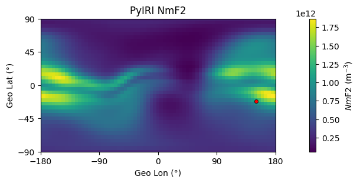
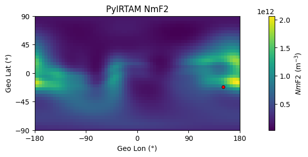
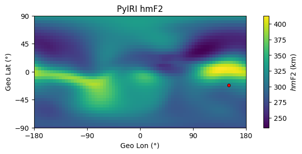
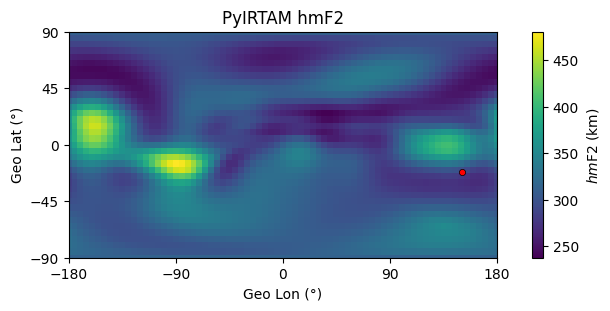
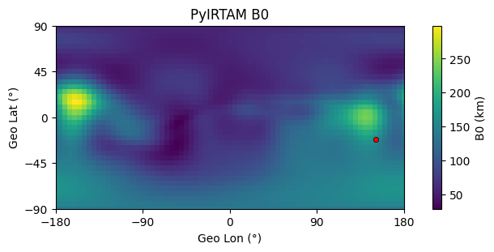
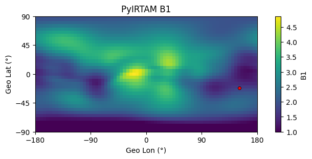
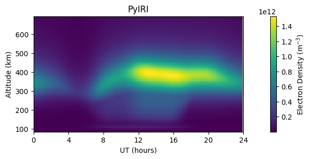
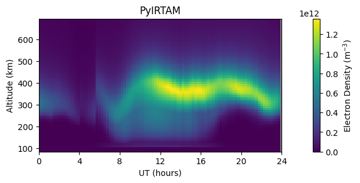

Example 1: Daily Ionospheric Parameters
=======================================

PyIRTAM can calculate daily ionospheric parameters for the user provided
IRTAM coefficients and grid. The estimation of the parameters occurs
simultaneously at all grid points and for all desired diurnal time frames. 

1. Import libraries:

::

   import numpy as np
   import PyIRI.main_library as ml
   import PyIRI.plotting as plot
   import PyIRTAM

2. Specify a directory on your machine where IRTAM coefficients live. Example:

::

   irtam_dir = '~/Documents/Science_VF2/PyIRTAM/IRTAM/'

3. Specify a directory on your machine where to save plots. Example:

::

   save_plot_dir = '~/Documents/'

4. Specify a year, a month, and a day:

::

   year = 2022
   month = 1
   day = 1

5. Specify solar flux index F10.7 in SFU:

::

   f107 = 90.8

6. Create any horizontal grid (regular or irregular, global or regional).
   The grid arrays (alon and alat) should be flattened to be 1-D arrays. 
   This is an example of a regular global grid:

::

   dlon = 5
   dlat = 5
   # Create 5x5 horizontal grid:
   alon, alat, alon_2d, alat_2d = ml.set_geo_grid(dlon, dlat)

7. Create any temporal array expressed in decimal hours (regular or irregular).
   IRTAM coefficients have 15-min resolution. For max resolution use 15 min.
   For this example we use regularly spaced time array:

::

   hr_res = 0.25
   ahr = np.arange(0, 24, hr_res)

8. Create height array. It can be regular or irregular.
   Here is an example for regularly spaced array:

::

   alt_res = 10
   alt_min = 90
   alt_max = 700
   aalt = np.arange(alt_min, alt_max, alt_res)
   
9. Run PyIRTAM:

::

   (f2_iri, f1_iri, e_iri, es_iri, sun, mag, edp_iri, f2_irtam, f1_irtam,
    e_irtam, es_irtam, edp_irtam) = PyIRTAM.run_PyIRTAM(year, month, day, ahr,
                                                        alon, alat, aalt, f107,
                                                        irtam_dir=irtam_dir,
                                                        use_subdirs=True,
                                                        download=False)

10. Plot results and save at given location, suggestion provided:

::

   # Make plots for a certain UT:
   UT_show = 2
   ind_time = np.where(ahr == UT_show)
   ind_grid = np.where(np.isfinite(alon))

   # ----------------------------------------------------------------------------
   plot_name='PyIRI_NmF2.png'
   figname = os.path.join(save_plot_dir, plot_name)
   fig, ax = plt.subplots(1, 1, sharex=True, sharey=True, figsize=(6, 3),
                           constrained_layout=True)
   ax.set_title('PyIRI NmF2')
   plt.xlim([-180, 180])
   plt.ylim([-90, 90])
   plt.xticks(np.arange(-180, 180 + 45, 90))
   plt.yticks(np.arange(-90, 90 + 45, 45))
   ax.set_facecolor('grey')
   ax.set_xlabel('Geo Lon (°)')
   ax.set_ylabel('Geo Lat (°)')
   z = np.reshape(f2_iri['Nm'][ind_time, ind_grid], alon_2d.shape)
   mesh = ax.pcolormesh(alon_2d, alat_2d, z)
   cbar = fig.colorbar(mesh, ax=ax)
   ax.scatter(sun['lon'][ind_time], sun['lat'][ind_time],
               c='red', s=20, edgecolors="black", linewidths=0.5)
   cbar.set_label('$Nm$F2 (m$^{-3}$)')
   plt.savefig(figname, format='png', bbox_inches='tight')

   # ----------------------------------------------------------------------------
   plot_name='PyIRI_hmF2.png'
   figname = os.path.join(save_plot_dir, plot_name)
   fig, ax = plt.subplots(1, 1, sharex=True, sharey=True, figsize=(6, 3),
                           constrained_layout=True)
   ax.set_title('PyIRI hmF2')
   plt.xlim([-180, 180])
   plt.ylim([-90, 90])
   plt.xticks(np.arange(-180, 180 + 45, 90))
   plt.yticks(np.arange(-90, 90 + 45, 45))
   ax.set_facecolor('grey')
   ax.set_xlabel('Geo Lon (°)')
   ax.set_ylabel('Geo Lat (°)')
   z = np.reshape(f2_iri['hm'][ind_time, ind_grid], alon_2d.shape)
   mesh = ax.pcolormesh(alon_2d, alat_2d, z)
   cbar = fig.colorbar(mesh, ax=ax)
   ax.scatter(sun['lon'][ind_time], sun['lat'][ind_time],
               c='red', s=20, edgecolors="black", linewidths=0.5)
   cbar.set_label('$hm$F2 (km)')
   plt.savefig(figname, format='png', bbox_inches='tight')

   # ----------------------------------------------------------------------------
   plot_name='PyIRTAM_NmF2.png'
   figname = os.path.join(save_plot_dir, plot_name)
   fig, ax = plt.subplots(1, 1, sharex=True, sharey=True, figsize=(6, 3),
                           constrained_layout=True)
   ax.set_title('PyIRTAM NmF2')
   plt.xlim([-180, 180])
   plt.ylim([-90, 90])
   plt.xticks(np.arange(-180, 180 + 45, 90))
   plt.yticks(np.arange(-90, 90 + 45, 45))
   ax.set_facecolor('grey')
   ax.set_xlabel('Geo Lon (°)')
   ax.set_ylabel('Geo Lat (°)')
   z = np.reshape(f2_irtam['Nm'][ind_time, ind_grid], alon_2d.shape)
   mesh = ax.pcolormesh(alon_2d, alat_2d, z)
   cbar = fig.colorbar(mesh, ax=ax)
   ax.scatter(sun['lon'][ind_time], sun['lat'][ind_time],
               c='red', s=20, edgecolors="black", linewidths=0.5)
   cbar.set_label('$Nm$F2 (m$^{-3}$)')
   plt.savefig(figname, format='png', bbox_inches='tight')

   # ----------------------------------------------------------------------------
   plot_name='PyIRTAM_hmF2.png'
   figname = os.path.join(save_plot_dir, plot_name)
   fig, ax = plt.subplots(1, 1, sharex=True, sharey=True, figsize=(6, 3),
                           constrained_layout=True)
   ax.set_title('PyIRTAM hmF2')
   plt.xlim([-180, 180])
   plt.ylim([-90, 90])
   plt.xticks(np.arange(-180, 180 + 45, 90))
   plt.yticks(np.arange(-90, 90 + 45, 45))
   ax.set_facecolor('grey')
   ax.set_xlabel('Geo Lon (°)')
   ax.set_ylabel('Geo Lat (°)')
   z = np.reshape(f2_irtam['hm'][ind_time, ind_grid], alon_2d.shape)
   mesh = ax.pcolormesh(alon_2d, alat_2d, z)
   cbar = fig.colorbar(mesh, ax=ax)
   ax.scatter(sun['lon'][ind_time], sun['lat'][ind_time],
               c='red', s=20, edgecolors="black", linewidths=0.5)
   cbar.set_label('$hm$F2 (km)')
   plt.savefig(figname, format='png', bbox_inches='tight')

   # ----------------------------------------------------------------------------
   plot_name='PyIRTAM_B0.png'
   figname = os.path.join(save_plot_dir, plot_name)
   fig, ax = plt.subplots(1, 1, sharex=True, sharey=True, figsize=(6, 3),
                           constrained_layout=True)
   ax.set_title('PyIRTAM B0')
   plt.xlim([-180, 180])
   plt.ylim([-90, 90])
   plt.xticks(np.arange(-180, 180 + 45, 90))
   plt.yticks(np.arange(-90, 90 + 45, 45))
   ax.set_facecolor('grey')
   ax.set_xlabel('Geo Lon (°)')
   ax.set_ylabel('Geo Lat (°)')
   z = np.reshape(f2_irtam['B0'][ind_time, ind_grid], alon_2d.shape)
   mesh = ax.pcolormesh(alon_2d, alat_2d, z)
   cbar = fig.colorbar(mesh, ax=ax)
   ax.scatter(sun['lon'][ind_time], sun['lat'][ind_time],
               c='red', s=20, edgecolors="black", linewidths=0.5)
   cbar.set_label('B0 (km)')
   plt.savefig(figname, format='png', bbox_inches='tight')

   # ----------------------------------------------------------------------------
   plot_name='PyIRTAM_B1.png'
   figname = os.path.join(save_plot_dir, plot_name)
   fig, ax = plt.subplots(1, 1, sharex=True, sharey=True, figsize=(6, 3),
                           constrained_layout=True)
   ax.set_title('PyIRTAM B1')
   plt.xlim([-180, 180])
   plt.ylim([-90, 90])
   plt.xticks(np.arange(-180, 180 + 45, 90))
   plt.yticks(np.arange(-90, 90 + 45, 45))
   ax.set_facecolor('grey')
   ax.set_xlabel('Geo Lon (°)')
   ax.set_ylabel('Geo Lat (°)')
   z = np.reshape(f2_irtam['B1'][ind_time, ind_grid], alon_2d.shape)
   mesh = ax.pcolormesh(alon_2d, alat_2d, z)
   cbar = fig.colorbar(mesh, ax=ax)
   ax.scatter(sun['lon'][ind_time], sun['lat'][ind_time],
               c='red', s=20, edgecolors="black", linewidths=0.5)
   cbar.set_label('B1')
   plt.savefig(figname, format='png', bbox_inches='tight')

1.  Plot density time series for PyIRI and PyIRTAM at specified location:

::

   lon_plot = 0
   lat_plot = 0

   plot_name='PyIRI_EDP_diurnal.png'
   figname = os.path.join(save_plot_dir, plot_name)
   fig, ax = plt.subplots(1, 1, figsize=(6, 3), constrained_layout=True)
   ax.set_title('PyIRI')
   plt.xlim([0, 24])
   plt.xticks(np.arange(0, 24 + 4, 4))
   ax.set_facecolor('grey')
   ax.set_xlabel('UT (hours)')
   ax.set_ylabel('Altitude (km)')
   ind_grid = np.where((alon == lon_plot) & (alat == lat_plot))[0]
   z = np.transpose(np.reshape(edp_iri[:, :, ind_grid], (ahr.size, aalt.size)))
   mesh = ax.pcolormesh(ahr, aalt, z)
   cbar = fig.colorbar(mesh, ax=ax)
   cbar.set_label('Electron Density (m$^{-3}$)')
   plt.savefig(figname, format='png', bbox_inches='tight')

   plot_name='PyIRTAM_EDP_diurnal.png'
   figname = os.path.join(save_plot_dir, plot_name)
   fig, ax = plt.subplots(1, 1, figsize=(6, 3), constrained_layout=True)
   ax.set_title('PyIRTAM')
   plt.xlim([0, 24])
   plt.xticks(np.arange(0, 24 + 4, 4))
   ax.set_facecolor('grey')
   ax.set_xlabel('UT (hours)')
   ax.set_ylabel('Altitude (km)')
   ind_grid = np.where((alon == lon_plot) & (alat == lat_plot))[0]
   z = np.transpose(np.reshape(edp_irtam[:, :, ind_grid], (ahr.size, aalt.size)))
   mesh = ax.pcolormesh(ahr, aalt, z)
   cbar = fig.colorbar(mesh, ax=ax)
   cbar.set_label('Electron Density (m$^{-3}$)')
   plt.savefig(figname, format='png', bbox_inches='tight')

